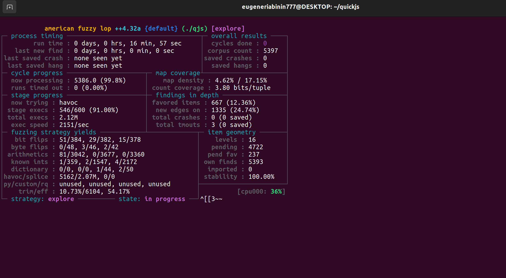
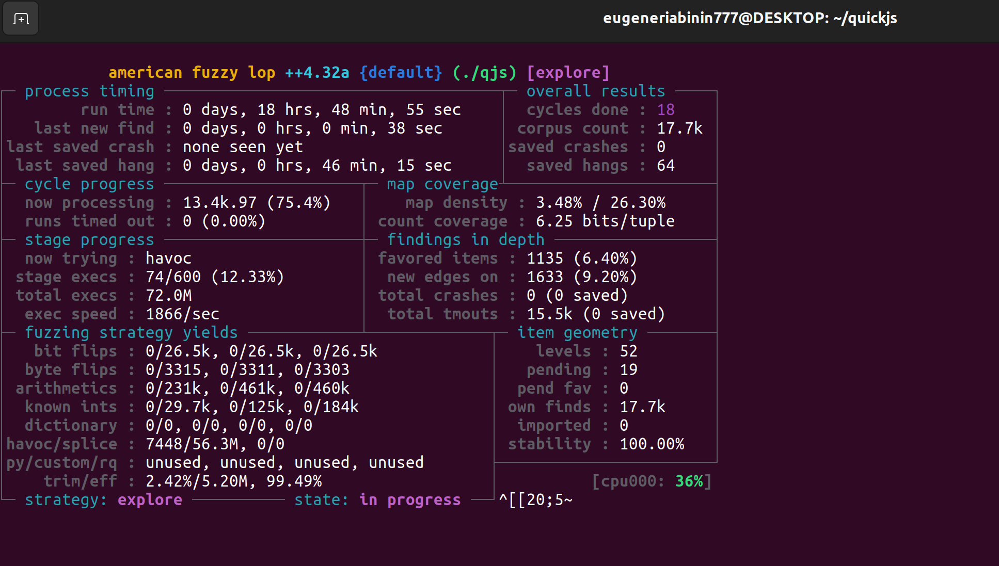
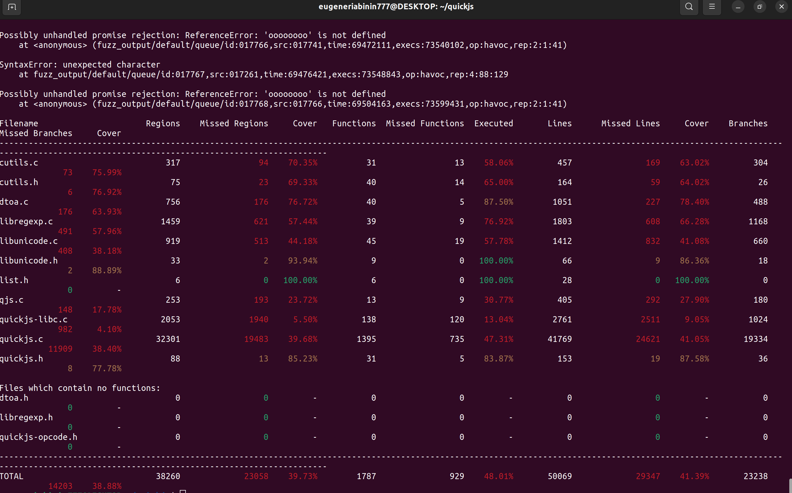
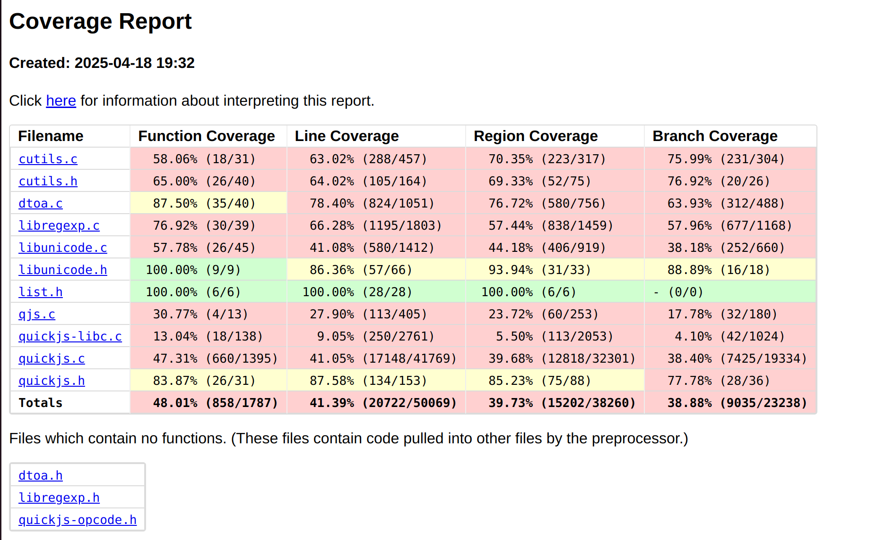
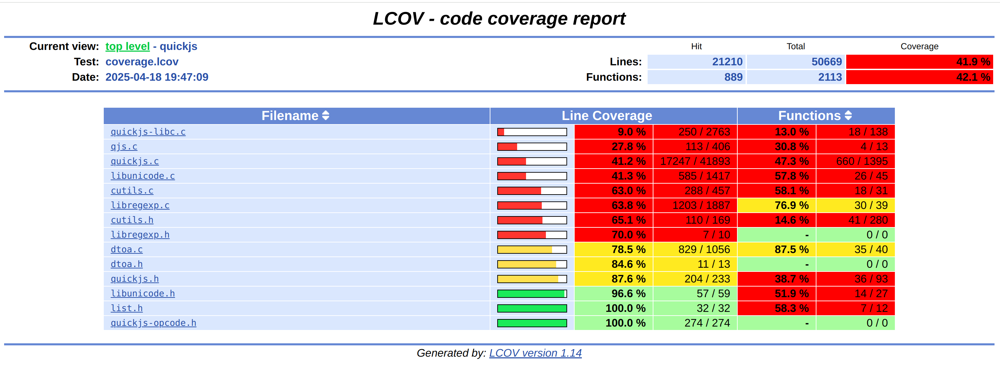

# quickjs_fuzzing
Здесь будет описан проект по фаззингу [QuickJS](https://github.com/bellard/quickjs). Будет описаны последовательности действий и результаты по трем этапам: контрольное суммирование файлов, фаззинг-тестирование и сбор покрытия по результатам фаззинг-тестирования.

## 0.Установка необходимых пакетов
Поскольку на Hyper-V Ubuntu 22.04 я установил совсем недавно, все пакеты устанавливаю с нуля.

Сначала установим Git
```
sudo apt update
sudo apt install git -y
```
Клонирум репозиторий QuickJS
```
git clone https://github.com/bellard/quickjs.git
cd quickjs
```
## 1.Контрольное суммирование файлов исходного кода
После установки нужных пакетов можно начать наш проект, а именно контрольное суммирование файлов исходного кода. В качестве решения вычислим SHA-256 контрольную сумму файлов репозитория
```
find . -type f -name "*.[ch]" -exec sha256sum {} + > controlsums.sha256
```

## 2.Фаззинг-тестирования
Теперь начнем основную часть этого проекта, а именно фаззинг-тестрование.

Установим AFL++ и нужные зависимости
```
sudo apt update
sudo apt install -y build-essential git wget cmake clang llvm python3-dev \
    libglib2.0-dev libpixman-1-dev zlib1g-dev ninja-build pkg-config

git clone https://github.com/AFLplusplus/AFLplusplus.git
cd AFLplusplus
make all
sudo make install
cd ..
```

Далее переходим в директорию quickjs и компилируем с инструментацией AFL++
```
cd quickjs
make clean

export CC=afl-clang-fast
export CXX=afl-clang-fast++
make
```

После этой команды возникла следующая ошибка
```
mkdir -p .obj .obj/examples .obj/tests
gcc -g -Wall -MMD -MF .obj/quickjs.check.o.d -Wno-array-bounds -Wno-format-truncation -Wno-infinite-recursion -fwrapv  -D_GNU_SOURCE -DCONFIG_VERSION=\"2024-02-14\" -DCONFIG_CHECK_JSVALUE -c -o .obj/quickjs.check.o quickjs.c
make: gcc: Нет такого файла или каталога
make: *** [Makefile:338: .obj/quickjs.check.o] Ошибка 127
```

Устраняется она просто. Вместо создания символических ссылок, указываем явно компилятор
```
make clean
CC=afl-clang-fast CXX=afl-clang-fast++ make -j$(nproc)
```

Следом создаем входные файлы для фаззинга
```
mkdir fuzz_inputs
echo "console.log('AFL++ test input');" > fuzz_inputs/test1.js
echo "let x = 5; if (x > 3) { throw 'Error'; }" > fuzz_inputs/test2.js
```

И запускаем наш фаззинг
```
mkdir fuzz_output
afl-fuzz -i fuzz_inputs -o fuzz_output -- ./qjs @@
```

На первый раз у нас возникнет ошибка
```
Error: [-] Your system is configured to send core dump notifications to an
    external utility. This will cause issues: there will be an extended delay
    between stumbling upon a crash and having this information relayed to the
    fuzzer via the standard waitpid() API.
    If you're just experimenting, set 'AFL_I_DONT_CARE_ABOUT_MISSING_CRASHES=1'.

    To avoid having crashes misinterpreted as timeouts, please 
    temporarily modify /proc/sys/kernel/core_pattern, like so:

    echo core | sudo tee /proc/sys/kernel/core_pattern

[-] PROGRAM ABORT : Pipe at the beginning of 'core_pattern'
         Location : check_crash_handling(), src/afl-fuzz-init.c:2547
```
Чтобы исправить ее, нужно установить простой режим создания core-дампов.
```
echo core | sudo tee /proc/sys/kernel/core_pattern
```
После этого повторяем команду с запуском фаззинга и ждем. Я фаззил почти 19 часов.

Вот как выглядело окно фаззинга на старте.



А вот как под конец



## 3.Сбор покрытия по результатам фаззинг тестирования
В заключительной части нам нужно собрать покрытие по результатам фаззинг-тестирования. Я это сделаю 3 способами: через консоль, с помощью llvm, и с помощью lcov.

Установим для начала lcov
```
sudo apt update
sudo apt install -y lcov
```

Далее делаем пересборку QuickJS с инструментацией для покрытия
```
make clean
export CC=clang
export CFLAGS="-fprofile-instr-generate -fcoverage-mapping"
export LDFLAGS="-fprofile-instr-generate -fcoverage-mapping"
make
```

Запускаем все тесты из результатов фаззинг-тестрования с записью покрытия
```
for test in fuzz_output/default/queue/*; do
    LLVM_PROFILE_FILE="$(pwd)/profraw/%m.profraw" ./qjs "$test"
done
```

Далее для совокупного анализа нам нужно объединить данные покрытия
```
llvm-profdata merge -output=coverage.profdata profraw/*.profraw
```

Генерируем текстовый отчет об покрытии
```
llvm-cov show ./qjs -instr-profile=coverage.profdata > coverage.txt
```

И после выводим сводный отчет в консоли
```
llvm-cov report ./qjs -instr-profile=coverage.profdata
```



Cгенерируем HTML-отчет llvm-покрытия
```
llvm-cov show ./qjs -instr-profile=coverage.profdata \
    -format=html -output-dir=coverage_report
xdg-open coverage_report/index.html
```



Также сформируем HTML-отчет lcov-покрытия
```
llvm-cov export ./qjs -instr-profile=coverage.profdata \
    -format=lcov > coverage.lcov

genhtml coverage.lcov -o coverage_report
xdg-open coverage_report/index.html
```


